# ECE1724 Project: Demokritos

A full-stack personalized learning platform.

## Team Information

| Name        | Student Number | Email                          |
|-------------|----------------|--------------------------------|
| David Zhang | 1003260918     | davidcw.zhang@mail.utoronto.ca |
| Tyler Sun   | 1007457645     | tyl.sun@mail.utoronto.ca       |
| Rohan Datta |                |                                |

---

## Motivation

Online learning has become a significant part of modern education thanks to higher flexiblity and cost-effectiveness, especially after the global pandemic. However, online learning poses unique challenges which can limit its effectiveness compared to in-person learning. Difficulties from online learning can arise from limited opportunities for in-person interactions and more ways to lose focus and motivation due to a differing environment. As such, it can be tough for teachers to properly pass along information and for students to truly learn new material efficiently through remote means. Our team chose this project with the goal of creating a new accessible and user-tailored online learning platform which address these barriers present in online learning today. Instructors will be able to create course on topics they are passionate about, and students will be able to enroll in courses on their own allowing both teachers and students to engage in material they are passionate about. With intuitive and streamlined course management on both ends, Demokritos aims to break down current barriers in online learning so both instructors and students can have a more positive online learning experience.

## Objectives

Demokritos, meaning "chosen of the people", aims to serve as an online, user friendly learning platform providing a customizable learning experience for students and a flexible central hub for instructors. The website should be designed for the user experience of instructors and students alike, meaning users should have designated permissions and roles in each of their courses depending on if they are a teacher or student for the course. Proper user authentication and a comprehensive user schema with user roles will be needed to achieve this.

Instructors should be able to create their own courses, upload relevant course material or links, and create assessments through in class quizzes or assignments. Students should be able to find open courses and enroll in classes of interest. In enrolled classes, they should be able to view published course modules, upload files to respond to assignments and answer quizzes posted by the teacher. Both parties will be able to engage with each other quickly and seamlessly through real time discussion for easy question and answer sessions if needed.

## Technical Stack

The application is developed with a full stack approach using Next.js.

Frontend: React framework with Tailwind CSS for styling and shadcn/ui components  
Backend: Next.js API routes  
Database: PostgreSQL with Prisma ORM schema  
File Management: Google Cloud Storage  
Authentication: Better Auth  
External APIs:

    Google Calendar API
    Veracity Learning API for quiz analytics
    Google Gemini API for an autograding option

Infrastructure: SSE (server-sent events) for real time discussion

Frontend and backend components are implemented with TypeScript. Playweight is used for end-to-end testing.

## Features

Users are able to register for an account and login to that account using any email. Once authenticated, users are able to explore the course marketplace showing open courses, enroll in open courses and create their own course for others. If a user creates a new course for the marketplace, they are assigned as an instructor for that course, and if a user enrolls in someone else's course, they are assigned a student role.

Instructors can:
- Edit course description and delete course
- Create teaching, assignment, or quiz modules
- Edit or delete existing modules
- Set deadlines for quizzes and assignments which can be seen on the course schedule
- View assignment submissions and grade them manually or using the Gemini autograder
- View quiz submissions and track class analytics

Students can:
- View modules and published course material
- Submit PDF files for assignments
- Take quiz attempts and submit quiz answers

Both students and instructors can browse the course schedule and sync it to their Google Calendar, as well as engage with each other by posting in the course discussion.

## User Guide

When a user visits the website for the first time, they will be prompted with Login and Sign Up options. If the user does not have an account, they should register an account with their name, an email address, and a password - they can later use this email and password to login after creating an account.

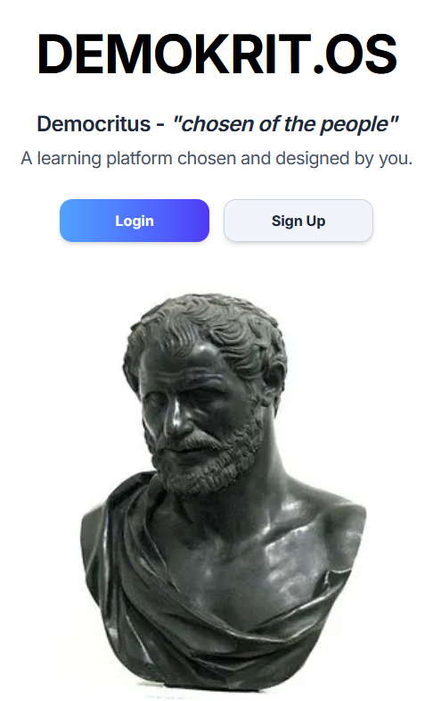
<hr style="border: 0.5px solid gray">
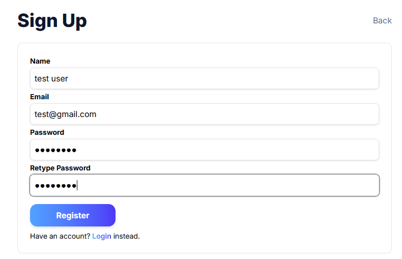


After logging in, users will be able to view open courses for enrollment by clicking on Add Course which will display options from the Course Marketplace. They can also teach a course by selecting Create Course next to Courses You Teach. Any courses you've created and are teaching can be seen here. Once you have enrolled in a course, it will appear in the Enrolled Course section showing the number of modules the course has and the courses's current completion status. Users can navigate back to this home page from any page by clicking on Demokrit.os on the top left, and log out from the option in the top right.

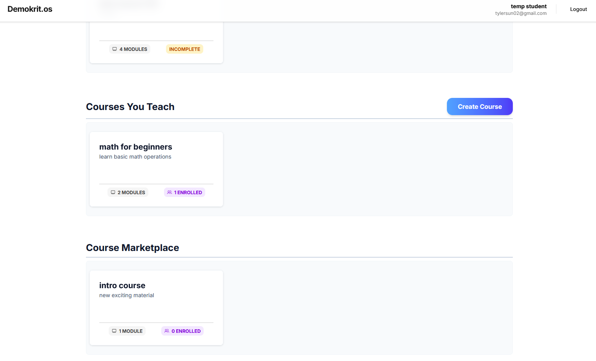

### Instructor Guide

Modals will pop up for instructors to create and edit their courses, as well as to create and edit course modules. A course name is mandatory to create a course, and an optional course description can also be provided. Instructors can create any number of course modules from three types, lecture, assignment, and quiz. A lecture module requires a lecture title and optional description, though it is best if the description contains a URL or some other information allowing students to learn new material. Assignments are similar, but also allow for the instructor to attach a PDF file for assignment questions and/or instructions which students can view. A deadline can be set which will be shown on the course schedule. The instructor can also enable AI autograding which automatically grades student submissions through Gemini AI if desired.

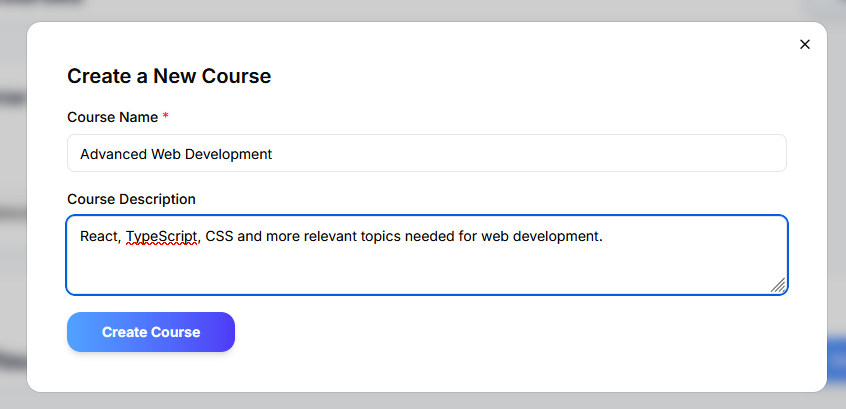

<hr style="border: 0.5px solid gray">


Quizzes can be created as well, where instructors can customize the time limit, maximum number of attempts and number of questions. Instructors can also set a due date, but unlike assignments, due dates here are optional allowing for practice quizzes if needed. Questions are multiple choice, and the number of options available in each question can be customized for each one.

Viewing quiz details will show overall quiz analytics from student attempts from the Veracity Learning API. Performance metrics shows total submissions, the average grade, and overall completion rate of the quiz. Behavioral analytics shows total quiz attempts or starts, total completions, the average duration taken on the quiz, and the average tab switches to another page over quiz attempts.

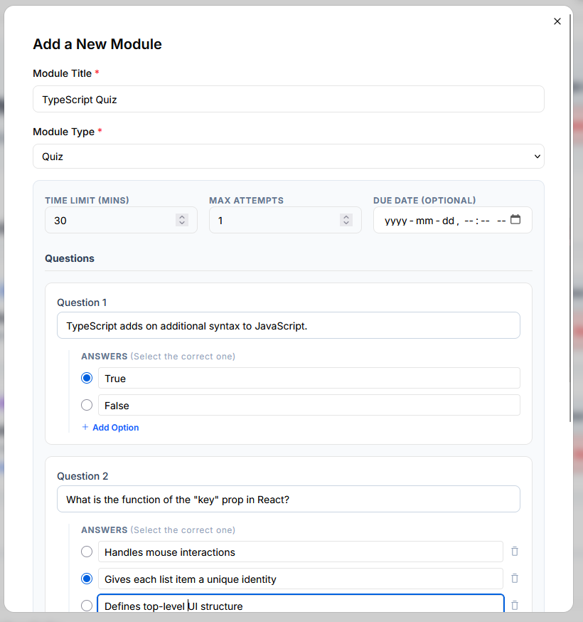

Instructors can view the course schedule and sync it to their personal Google Calendar if desired. They can also participate in course discussion at the bottom of the course page to answer questions and encourage interactivity with their students. Comments from an instructor will have a red marker to help distinguish their answers from student posts. Instructors are able to moderate discussion by deleting any comment posted in the course discussion if desired.

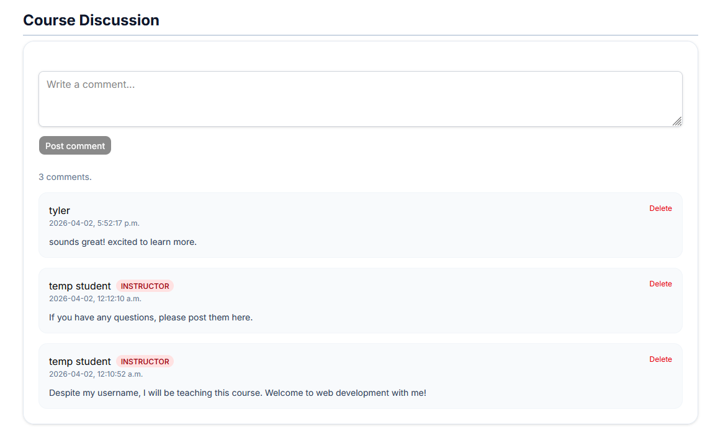

### Student Guide

For courses not taught by the user, you can scroll through the course marketplace to find open courses for enrollment. To enroll in the course, click on the course window, and then find the Enroll Now button at the top of the course page. Once enrolled, the button should display the Enrolled message instead, and the student status will be displayed in the header in the top right. In addition, the course will now appear in their Enrolled Courses rather than in the marketplace in their home page.

After enrolling, students can view course module details, download assignment files and take quiz attempts for the class. If they attempt to access a module before enrolling, they will be redirected back to the course page. To respond to assignments, students can attach a PDF file to submit their answers any time before the provided deadline. For quizzes, students can view quiz details including time limit, attempts they have remaining, and submission deadline before attempting. They can exit out of the quiz even after starting and resume it later, as long as it is submitted before the deadline.

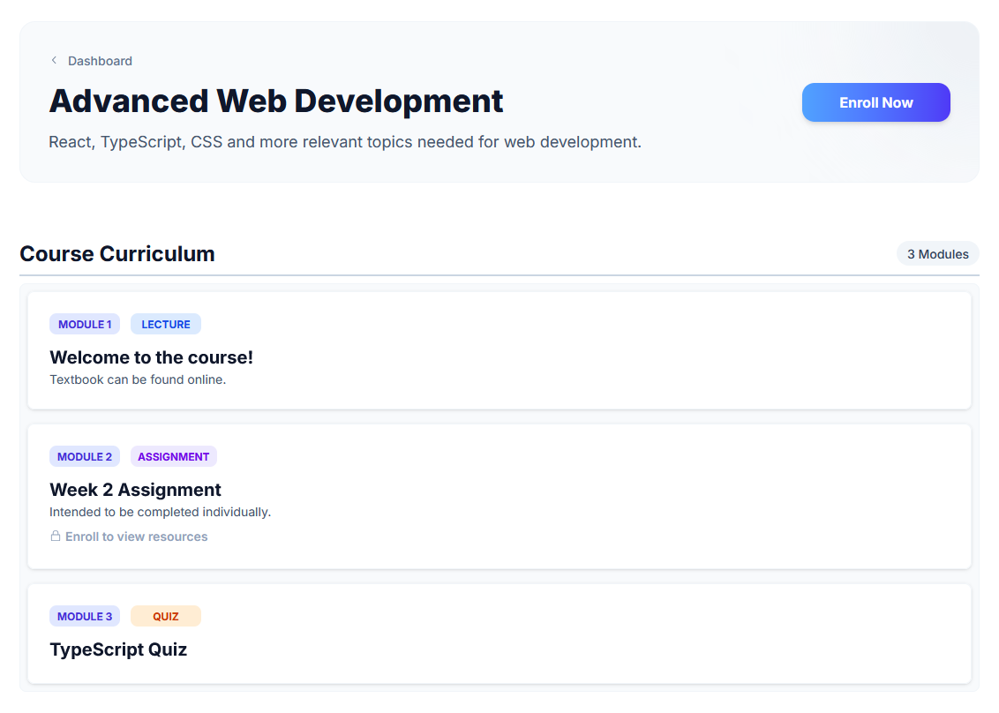

<hr style="border: 0.5px solid gray">

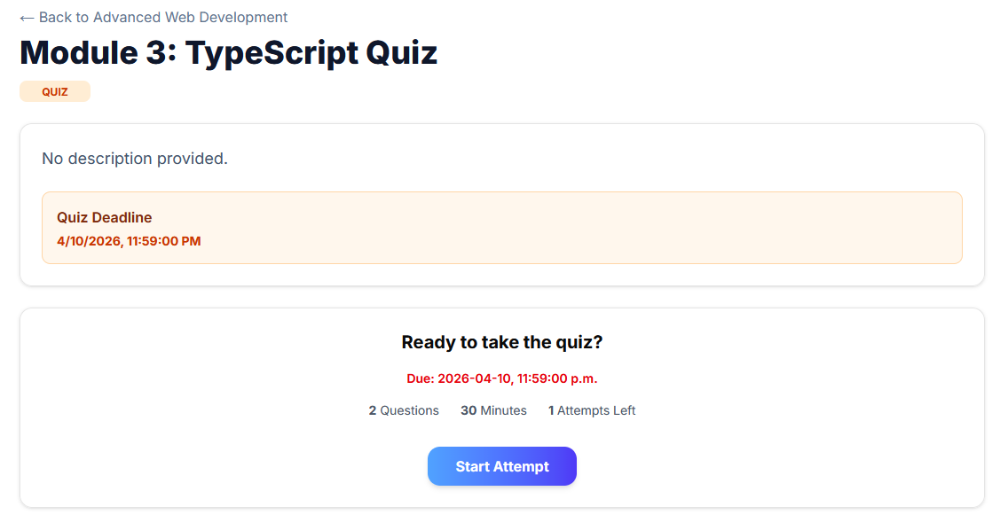

After submitting an assignment or quiz, students will recieve a message confirming their submission. Quiz marks will be reported to the student immediately after submission, and they can also recieve a grade immediately on assignment submissions as well with the AI autograding feature.

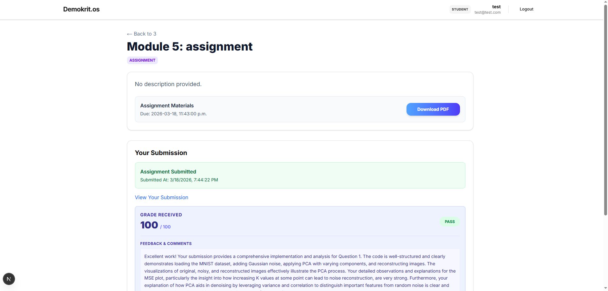

<hr style="border: 0.5px solid gray">

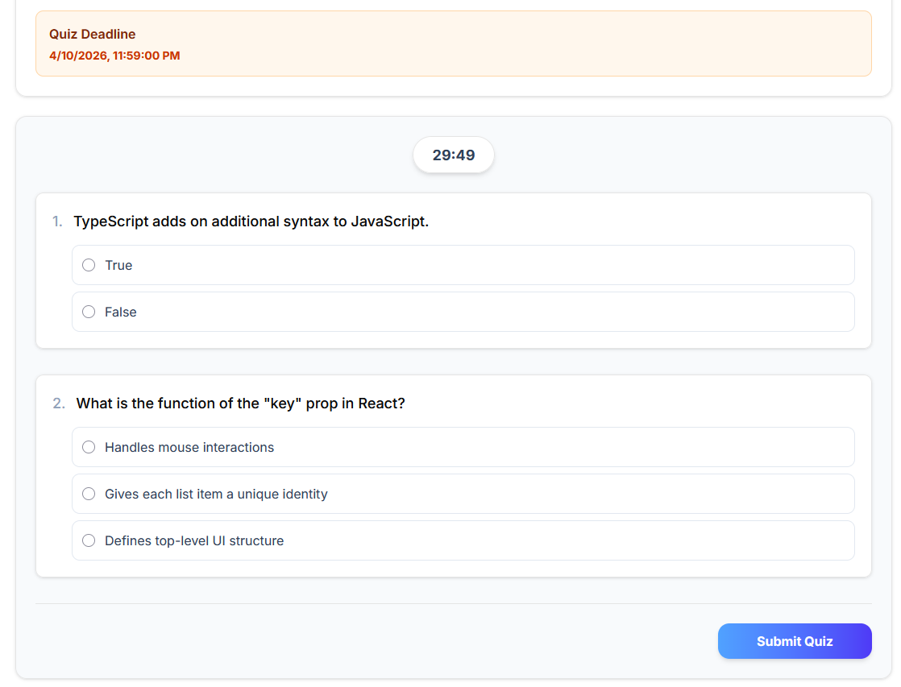

Similarly to instructors, students can view upcoming deadlines through the course schedule and sync it to their own Google Calendar. They can also leave messages in the course discussion after joining the course to engage with other students and communicate with the instructor as necessary. Unlike the instructor role, students are only able to delete their own comments after posting.

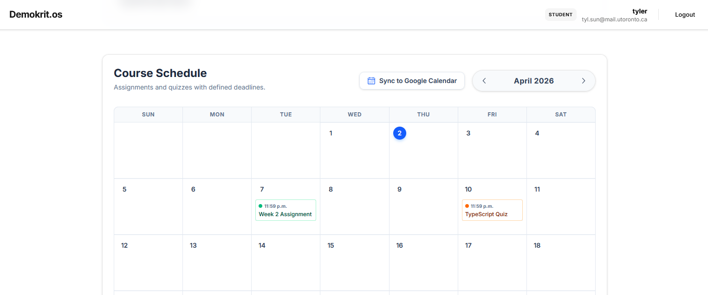

## Development Guide

Can also be viewed as a separate document in DEVELOPERS.md.

### 1. Initial Setup

After pulling down the repository, you'll need to install dependencies and configure your environment:

```bash
# Install all node packages
npm install

# Make sure you have a .env file containing the following variables:
# DATABASE_URL=""
# NEXT_PUBLIC_API_BASE_URL=""
# BETTER_AUTH_SECRET=
# BETTER_AUTH_URL=

# Veracity LRS Configuration for Quiz Analytics
# LRS_ENDPOINT=""
# LRS_KEY=""
# LRS_SECRET=""

# Google GenAI Configuration for Assignment Autograding
# GEMINI_API_KEY=""

# Google Calendar OAuth Configuration
# GOOGLE_CLIENT_ID=""
# GOOGLE_CLIENT_SECRET=""
```

The Better Auth secret can be generated through https://better-auth.com/docs/installation or using the following:
```bash
openssl rand -base64 32
```

For quiz analytics, create a Veracity Learning account here: https://lrs.io/ui/users/home/0/
Create a new LRS with any name, then within that LRS, naivgate to Management -> Access Keys and create a new access key, which will give the configuration variables above.

For Google Calendar Sync features, you must enable the Calendar API via Google Cloud Console, configure your OAuth Consent Screen with the `https://www.googleapis.com/auth/calendar.events` scope, and provision an OAuth Client ID explicitly bound to `http://localhost:3000/api/auth/callback/google` to test synchronization functionality locally.

### 2. Database Initialization

We use Prisma as our ORM. If this is a fresh pull, you must generate the client and push the schema to your database.

```bash
# Generate the Prisma Client
npx prisma generate

# Push the schema structure to your database
npx prisma db push
```

### 3. Setting up Google Cloud Storage (GCS)
1. Create a Google Cloud account if you have not done so already.
2. Create a GCS bucket in your desired region of choice with default settings. <u><b>TURN OFF PUBLIC ACCESS</b></u>
3. Download gcloud cli (https://cloud.google.com/cli)
4. Set up your CORS configuration to be able to access the S3 bucket using the provided `cors-config.json` file:
    ```shell
    gcloud storage buckets update gs://BUCKET_NAME --cors-file=CORS_CONFIG_FILE
    ```
5. Check to see if your CORS configuration has changed with:
    ```shell
    gcloud storage buckets describe gs://BUCKET_NAME --format="json"
    ```
6. Go to the `Settings → Interoperability` in the GCS console and create an access key for your account
7. Add the corresponding secrets to your `.env` file
    ```
    # S3 Access Key Credentials (Check the Interoperability tab in GCS)
    S3_ACCESS_KEY_ID=<google_access_key>
    S3_ACCESS_KEY_SECRET=<google_access_secret>
    
    # Bucket details
    S3_BUCKET_NAME=<gcs_bucket_name>
    
    # The GCS S3-compatible endpoint and other configs
    S3_ENDPOINT=https://storage.googleapis.com
    S3_REGION=<google_service_region>
    S3_FORCE_PATH_STYLE=true
    ``` 

### 4. Running the API Unit Tests (Vitest)

We use Vitest to mock HTTP requests and test the specific isolated logic of the API endpoints directly (`/api/courses`, etc.). The test suites are now modularized into:
- `tests/general.api.test.ts`
- `tests/instructor.api.test.ts`
- `tests/student.api.test.ts`

```bash
# Run the entire Vitest test suite once
npx vitest run

# Run a specific Vitest suite
npx vitest run tests/student.api.test.ts

# Run Vitest in watch mode (updates automatically as you write code)
npx vitest
```

### 5. Running the Browser UI Tests (Playwright)

We use Playwright to simulate a real user opening a Chromium browser, interacting with the Unified Dashboard, and creating or enrolling in courses. The test suites are divided into:
- `tests/general.spec.ts`
- `tests/instructor.spec.ts`
- `tests/student.spec.ts`

Note: Playwright requires the Next.js development server to be actively running in the background because it hits `http://localhost:3000`.

```bash
# In Terminal 1: Start the Next.js app
npm run dev

# In Terminal 2: Run the entire Playwright test suite
npx playwright test

# Or run a specific Playwright test file
npx playwright test tests/instructor.spec.ts

# View the visual HTML report of the test results
npx playwright show-report
```

### Troubleshooting
If Playwright is failing due to timeout issues, ensure your development server is completely loaded.

## Deployment Guide
N/A

## AI Assistance & Verification (Summary)

## Individual Contributions

| Name        | Contributions                                                                                                                                                                                                                                                                                                                                                                                                                                                                                                                                                                                                                                                                           |
|-------------|-----------------------------------------------------------------------------------------------------------------------------------------------------------------------------------------------------------------------------------------------------------------------------------------------------------------------------------------------------------------------------------------------------------------------------------------------------------------------------------------------------------------------------------------------------------------------------------------------------------------------------------------------------------------------------------------|
| David Zhang | - Outlined, configured, and updated the Postgres schema to accomodate project scope <br/> - Created the login/register forms and incorporated Better Auth to handle user sessional information and account persistence <br/> - Unified UI theming across all pages `./lib/ui.ts` <br/> - Converted course and module creation and modification forms into modals using Nextjs parallel routes and intercepting routes <br/> - Added secured api routes for GCS (s3-compatible object storage) to dynamically generate expirable URLs for users and clients to upload and retrieve file information. Additionally updates Postgres with the appropriate file metadata through Prisma ORM |
| Tyler Sun   | - Created option to edit existing courses and their description for instructors <br/> - Implemented real time course discussion using SSEs for enrolled students and instructors broadcasting new comments and discussion updates to all connected users <br/> - Designed and developed application landing page with login and registration options <br/> - Documented motivation, objectives, technical stack features, and user guide sections |
| Rohan Datta |                                                                                                                                                                                                                                                                                                                                                                                                                                                                                                                                                                                                                                                                                         |


The report should clearly and concisely cover the following aspects:

    Team Information: List the names, student numbers, and preferred email addresses of all team members. Make sure these email addresses are active as they may be used for clarification requests.

    Motivation: Explain why your team chose this project, the problem it addresses, and its significance.

    Objectives: State the project objectives and what your team aimed to achieve through the implementation.

    Technical Stack: Describe the technologies used, including the chosen approach (Next.js Full-Stack or Express.js Backend), database solution, and other key technologies.

    Features: Outline the main features of your application and explain how they fulfill the course project requirements and achieve your objectives.

    User Guide: Provide clear instructions for using each main feature, supported with screenshots where appropriate.

    Development Guide: Include steps to set up the development environment, covering
        Environment setup and configuration
        Database initialization
        Cloud storage configuration
        Local development and testing

    Deployment Information (if applicable): Provide the live URL of your application and relevant deployment platform details.

    AI Assistance & Verification (Summary): If AI tools contributed to your project, provide a concise, high-level summary demonstrating that your team:
        Understands where and why AI tools were used
        Can evaluate AI output critically
        Verified correctness through technical means

    Specifically, briefly address:
        Where AI meaningfully contributed (e.g.,architecture exploration, database queries, debugging, documentation)
        One representative mistake or limitation in AI output (details should be documented in ai-session.md)
        How correctness was verified (e.g., manual testing of user flows, logs, unit or integration tests)

    Do not repeat full AI prompts or responses here. Instead, reference your ai-session.md file for concrete examples.

    Individual Contributions: Describe the specific contributions of each team member, aligning with Git commit history.

    Lessons Learned and Concluding Remarks: Share insights gained during development and any final reflections on the project experience.


