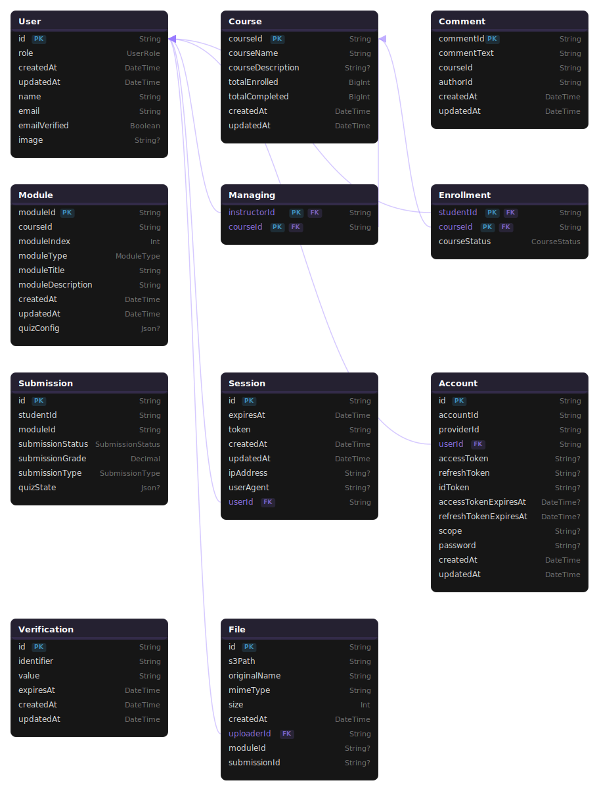

# ECE1724 Project: Demokritos

A full-stack personalized learning platform.

## Team Information

| Name        | Student Number | Email                          |
|-------------|----------------|--------------------------------|
| David Zhang | 1003260918     | davidcw.zhang@mail.utoronto.ca |
| Tyler Sun   | 1007457645     | tyl.sun@mail.utoronto.ca       |
| Rohan Datta | 1007159628     | rohan.datta@mail.utoronto.ca   |

### Open Source Documentation

This project is released under the **[MIT License](LICENSE)**. Additional documentation for contributors and developers:
- [**API.md**](API.md) — Full REST API reference with request/response schemas and error codes
- [**COMPONENTS.md**](COMPONENTS.md) — React component documentation with props tables and architecture overview
- [**CONTRIBUTING.md**](CONTRIBUTING.md) — Contribution guidelines covering branching, commits, coding standards, and the PR process

---

## Motivation

Online learning has become a significant part of modern education thanks to higher flexiblity and cost-effectiveness, especially after the global pandemic. However, online learning poses unique challenges which can limit its effectiveness compared to in-person learning. Difficulties from online learning can arise from limited opportunities for in-person interactions and more ways to lose focus and motivation due to a differing environment. As such, it can be tough for teachers to properly pass along information and for students to truly learn new material efficiently through remote means. Our team chose this project with the goal of creating a new accessible and user-tailored online learning platform which address these barriers present in online learning today. Instructors will be able to create course on topics they are passionate about, and students will be able to enroll in courses on their own allowing both teachers and students to engage in material they are passionate about. With intuitive and streamlined course management on both ends, Demokritos aims to break down current barriers in online learning so both instructors and students can have a more positive online learning experience.

More specifically, Demokritos targets the fragmented tooling that independent educators face today. Existing systems like Blackboard or Moodle are built for large institutions with dedicated IT departments, leaving independent tutors, workshop leaders, and freelance instructors without a unified platform. These educators end up juggling disconnected services: course content on Google Drive, quizzes in Google Forms, deadlines in spreadsheets, and communication scattered across email and group chats. A tutor teaching Python on weekends or a study group leader running exam prep sessions has no institutional LMS, and managing even one course across five tools creates real overhead. For students, this fragmentation adds cognitive load since they must jump between platforms to find materials, submit work, and check grades. Demokritos addresses this gap by providing a self contained, marketplace style platform where any individual can create a fully functional course with modules, timed quizzes, assignment submissions with AI grading, a deadline calendar, and real time discussion, all from a single web application with no institutional license required.

## Objectives

Demokritos, meaning "chosen of the people", aims to serve as an online, user friendly learning platform providing a customizable learning experience for students and a flexible central hub for instructors. The website should be designed for the user experience of instructors and students alike, meaning users should have designated permissions and roles in each of their courses depending on if they are a teacher or student for the course. Proper user authentication and a comprehensive user schema with user roles will be needed to achieve this.

Instructors should be able to create their own courses, upload relevant course material or links, and create assessments through in class quizzes or assignments. Students should be able to find open courses and enroll in classes of interest. In enrolled classes, they should be able to view published course modules, upload files to respond to assignments and answer quizzes posted by the teacher. Both parties will be able to engage with each other quickly and seamlessly through real time discussion for easy question and answer sessions if needed.

To clarify the concrete scope: roles are assigned on a **per-user, per-course basis**, so the same user can be an instructor in one course and a student in another. Authentication is handled through Better Auth with email/password and Google OAuth support, and route level authorization enforces instructor only actions server side on every API request. The platform supports three module types: **Lectures** (content with optional file attachments), **Assignments** (PDF submissions with due dates and optional AI autograding via Google Gemini), and **Quizzes** (timed, multi attempt, multiple choice assessments with configurable limits). Students discover courses through an open marketplace, enroll with one click, and interact with module content through dedicated submission and quiz taking interfaces. Real time discussion uses Server-Sent Events to deliver instant comment updates to all connected participants without polling.

## Technical Stack
The application is developed with a full stack approach using Next.js.


Frontend: React framework with Tailwind CSS for styling and shadcn/ui components  
Backend: Next.js API routes  
Database: [PostgreSQL with Prisma ORM schema](#postgres-schema)  
File Management: Google Cloud Storage  
Authentication: Better Auth  
External APIs:

    Google Calendar API
    Veracity Learning API for quiz analytics
    Google Gemini API for an autograding option

Infrastructure: SSE (server-sent events) for real time discussion

Frontend and backend components are implemented with TypeScript. Playwright is used for end-to-end testing.

To further explain how the architecture connects to the application’s behavior, the following table describes each technology layer and its specific role within the system:

| Layer | Technology | Role in System |
|-------|-----------|----------------|
| **Frontend** | React 19, Tailwind CSS, shadcn/ui | Renders all pages. Client components (`"use client"`) handle interactive UI like the quiz timer, file upload, and the discussion feed. Server components handle data fetching and initial rendering. |
| **Backend** | Next.js API Routes (App Router) | Each file in `app/api/` exports HTTP method handlers (`GET`, `POST`, `PUT`, `DELETE`) that authenticate the session, validate input, query the database via Prisma, and call external APIs as needed before returning JSON responses. |
| **Database** | PostgreSQL + Prisma ORM | Stores all relational data: users, courses, modules, enrollments, submissions, comments, and OAuth account tokens. Prisma’s `$transaction()` is used for atomic operations such as module deletion with index re-ordering and course deletion with cascading cleanup. |
| **File Storage** | Google Cloud Storage (S3-compatible) | Stores uploaded PDFs for assignment instructions and student submissions. The backend generates short lived presigned URLs (5 minute expiry) for secure uploads and downloads so file binaries never pass through the API server. |
| **Authentication** | Better Auth | Manages sessions, email/password registration, and Google OAuth with offline access. OAuth tokens including refresh tokens are persisted in the `Account` table, enabling features like Google Calendar sync without requiring the user to re authenticate. |
| **Real-Time (SSE)** | Server-Sent Events | Powers the live discussion forum. The server holds each connection open via a `ReadableStream` and maintains an in memory `Map` of active controllers per course. When a comment is posted or deleted, the handler iterates over all controllers for that course and enqueues the event, delivering updates to every connected client instantly. |
| **Google Calendar** | `googleapis` npm package | Reads stored OAuth2 tokens from the database, instantiates an `OAuth2Client`, and calls `calendar.events.insert()` to push course deadlines as calendar events on the user’s primary Google Calendar. If the stored token lacks the `calendar.events` scope, the frontend detects the 403 response and automatically triggers a `linkSocial` re-authorization flow. |
| **Quiz Analytics** | Veracity LRS (xAPI) | The quiz component sends xAPI statements (`initialized`, `suspended`, `completed`) to the `/api/lrs` proxy, which forwards them with Basic Auth to the external LRS. Instructors retrieve aggregated telemetry (attempt counts, average duration, tab-switch counts) via a GET request to the same proxy endpoint. |
| **AI Autograding** | Google Gemini API (`@google/genai`) | When enabled on an assignment, the submission handler downloads the student’s PDF from GCS, uploads it to Gemini’s File API, and prompts the model with the instructor’s rubric and strictness level (lenient, standard, or strict). The model returns a structured JSON response containing a numeric grade (0–100) and written feedback, which are persisted on the submission record immediately. |
| **Testing** | Vitest (unit), Playwright (E2E) | API route logic is unit-tested with mocked HTTP requests via `node-mocks-http`. Playwright drives a real Chromium browser against `localhost:3000` for end-to-end flows covering registration, course creation, enrollment, and module interactions. |

## Features

Users are able to register for an account and login to that account using any email. Once authenticated, users are able to explore the course marketplace showing open courses, enroll in open courses and create their own course for others. If a user creates a new course for the marketplace, they are assigned as an instructor for that course, and if a user enrolls in someone else's course, they are assigned a student role. More specifically, roles are assigned on a per-user per-course basis; a user with student access in one course can still have instructor access in another.

Instructors can:
- Edit course description and delete course
- Create teaching, assignment, or quiz modules
- Edit or delete existing modules
- Set deadlines for quizzes and assignments which can be seen on the course schedule
- View assignment submissions and grade them manually or using the Gemini autograder
- View quiz submissions and track class analytics

Students can:
- View modules and published course material
- Submit PDF files for assignments
- Take quiz attempts and submit quiz answers

Both students and instructors can browse the course schedule and sync it to their Google Calendar, as well as engage with each other by posting in the course discussion.

### Feature Implementation Details

Below are the concrete implementation details for each major feature:

**Course & Module Management**: Course deletion cascades through all related data (modules, enrollments, submissions, managing records, comments) within a single Prisma `$transaction()` to maintain data integrity. Module creation automatically assigns the next sequential index, and module deletion re-indexes all subsequent modules by decrementing their positions—also within a transaction to prevent race conditions.

**Quiz Engine**: Quizzes support multiple-choice questions with 2 or more answer options per question, each with exactly one correct answer. The quiz configuration is validated server-side using a Zod schema (`QuizConfigSchema`) before persistence. When a student starts an attempt, the server records an `activeAttemptStartTime` timestamp. If the student refreshes or loses connection, the `/start` endpoint detects the existing active attempt and returns the original start time, allowing the frontend to calculate the correct remaining time. When the countdown reaches zero, the client auto-submits whatever answers have been selected. Attempt tracking is cumulative—the system stores the best grade across all attempts for final evaluation. The pass threshold is 50%.

**Assignment Submission & AI Grading**: Students upload PDF files through a two-step process: first, a `POST /api/gcs/upload` request registers the file in the database and returns a presigned upload URL; second, the client `PUT`s the file binary directly to Google Cloud Storage using that URL. This ensures file data never flows through the API server. When AI autograding is enabled, the submission handler downloads the PDF from GCS into a temporary file, uploads it to Google Gemini’s File API, and sends a structured prompt containing the instructor’s rubric and selected strictness level. The Gemini model responds with a JSON object containing a `grade` (0–100) and `feedback` string, which are stored on the submission record. If the AI grading pipeline fails for any reason, the system gracefully falls back to manual grading with a note that the autograder could not process the document.

**Real-Time Discussion (SSE Architecture)**: The discussion forum opens a persistent SSE connection when the course page loads. On the server, each connection's controller is stored in an in memory `Map` keyed by course ID. When a comment is posted or deleted, the handler broadcasts the event to all controllers for that course via `controller.enqueue()`. The SSE endpoint also sends an `initial` event on connection containing all existing comments, so clients always start with a complete view. The client retries automatically every 3 seconds if the connection drops.

**Google Calendar Sync Flow**: The calendar sync endpoint reads the user’s stored Google OAuth2 access and refresh tokens from the `Account` table (persisted by Better Auth during the OAuth sign-in flow). It instantiates a `google.auth.OAuth2` client with these credentials and iterates over all modules in the course that have a due date (from either `quizConfig.dueDate` or `assignmentConfig.dueDate`). For each deadline, it calls `calendar.events.insert()` to create an event on the user’s primary Google Calendar with the summary `[Course Name] Due: Module Title`, a 1-hour time block, and a description containing the module description and a direct URL to the module page. If the API returns a 403 (insufficient scopes), the backend returns a specific `Google_Insufficient_Scopes` error code, which the frontend catches and uses to trigger an automatic `authClient.linkSocial()` re-authorization flow—prompting the user to grant the `calendar.events` permission without losing their session.

**Quiz Behavioral Analytics (xAPI/LRS)**: During a quiz attempt, the `QuizTracker` component sends xAPI statements to the `/api/lrs` proxy: `initialized` when the attempt starts, `suspended` on tab switches (via the `visibilitychange` event), and `completed` with the final score on submission. The proxy forwards these to the external Veracity LRS. Instructors view aggregated metrics on the module page via the `InstructorLrsDashboard` component, which computes totals for starts, completions, average duration, and average tab switches per student.

## Video Demo
https://youtu.be/s5gpCJq8ddY

## User Guide

When a user visits the website for the first time, they will be prompted with Login and Sign Up options. If the user does not have an account, they should register an account with their name, an email address, and a password - they can later use this email and password to login after creating an account.


<hr style="border: 0.5px solid gray">


After logging in, users will be able to view open courses for enrollment by clicking on Add Course which will display options from the Course Marketplace. They can also teach a course by selecting Create Course next to Courses You Teach. Any courses you've created and are teaching can be seen here. Once you have enrolled in a course, it will appear in the Enrolled Course section showing the number of modules the course has and the courses's current completion status. Users can navigate back to this home page from any page by clicking on Demokrit.os on the top left, and log out from the option in the top right.


### Instructor Guide

Modals will pop up for instructors to create and edit their courses, as well as to create and edit course modules. A course name is mandatory to create a course, and an optional course description can also be provided. Instructors can create any number of course modules from three types, lecture, assignment, and quiz. A lecture module requires a lecture title and optional description, though it is best if the description contains a URL or some other information allowing students to learn new material. Assignments are similar, but also allow for the instructor to attach a PDF file for assignment questions and/or instructions which students can view. A deadline can be set which will be shown on the course schedule. The instructor can also enable AI autograding which automatically grades student submissions through Gemini AI if desired.


<hr style="border: 0.5px solid gray">


Quizzes can be created as well, where instructors can customize the time limit, maximum number of attempts and number of questions. Instructors can also set a due date, but unlike assignments, due dates here are optional allowing for practice quizzes if needed. Questions are multiple choice, and the number of options available in each question can be customized for each one.

Viewing quiz details will show overall quiz analytics from student attempts from the Veracity Learning API. Performance metrics shows total submissions, the average grade, and overall completion rate of the quiz. Behavioral analytics shows total quiz attempts or starts, total completions, the average duration taken on the quiz, and the average tab switches to another page over quiz attempts.


Instructors can view the course schedule and sync it to their personal Google Calendar if desired. If prompted, users should accept permission/access requests from Google for this. They can also participate in course discussion at the bottom of the course page to answer questions and encourage interactivity with their students. Comments from an instructor will have a red marker to help distinguish their answers from student posts. Instructors are able to moderate discussion by deleting any comment posted in the course discussion if desired.


### Student Guide

For courses not taught by the user, you can scroll through the course marketplace to find open courses for enrollment. To enroll in the course, click on the course window, and then find the Enroll Now button at the top of the course page. Once enrolled, the button should display the Enrolled message instead, and the student status will be displayed in the header in the top right. In addition, the course will now appear in their Enrolled Courses rather than in the marketplace in their home page.

After enrolling, students can view course module details, download assignment files and take quiz attempts for the class. If they attempt to access a module before enrolling, they will be redirected back to the course page. To respond to assignments, students can attach a PDF file to submit their answers any time before the provided deadline. For quizzes, students can view quiz details including time limit, attempts they have remaining, and submission deadline before attempting. They can exit out of the quiz even after starting and resume it later, as long as it is submitted before the deadline.


<hr style="border: 0.5px solid gray">


After submitting an assignment or quiz, students will recieve a message confirming their submission. Quiz marks will be reported to the student immediately after submission, and they can also recieve a grade immediately on assignment submissions as well with the AI autograding feature.


<hr style="border: 0.5px solid gray">


Similarly to instructors, students can view upcoming deadlines through the course schedule and sync it to their own Google Calendar by granting permissions to Google as requested. They can also leave messages in the course discussion after joining the course to engage with other students and communicate with the instructor as necessary. Unlike the instructor role, students are only able to delete their own comments after posting.


## Development Guide

Can also be viewed as a separate document in [DEVELOPERS.md](DEVELOPERS.md), which contains full step-by-step instructions for all external services. Credentials for the live instance have been sent directly to the TA, with this the entire application should work, but if you want to see artifacts on the external platforms you will need to set-up the services yourself (which are explained below).

### 1. Install Dependencies & Configure Environment

Run `npm install`, copy `.env.example` to `.env`, and fill in the required variables: database connection string, Better Auth secret, Google OAuth credentials, GCS bucket credentials, Gemini API key, and Veracity LRS credentials. See [DEVELOPERS.md](DEVELOPERS.md) for how to obtain each value.

### 2. Database Initialization

With a running PostgreSQL instance pointed to by `DATABASE_URL`, run `npx prisma generate` then `npx prisma db push` to generate the Prisma client and push the schema.

### 3. Google Cloud Storage Setup

Create a private GCS bucket, apply the provided `cors-config.json` via `gcloud`, and generate an HMAC key from **Settings → Interoperability** in the GCS Console. See [DEVELOPERS.md](DEVELOPERS.md) for the full setup steps.

### 4. External API Setup

- **Google OAuth & Calendar**: Enable the Calendar API in Google Cloud Console, configure the OAuth consent screen with the required scopes, and create an OAuth Client ID with the redirect URI `http://localhost:3000/api/auth/callback/google`.
- **Google Gemini**: Generate an API key from [Google AI Studio](https://aistudio.google.com/app/apikey) and set `GEMINI_API_KEY`.
- **Veracity LRS**: Create a free account at [lrs.io](https://lrs.io), create a new LRS, and generate an access key pair under **Management → Access Keys**.

### 5. Running Locally & Testing

```bash
npm run dev          # Start development server at http://localhost:3000
npx vitest run       # Run Vitest API unit tests
npx playwright test  # Run Playwright E2E tests (dev server must be running)
```

## Deployment Guide
N/A

## AI Assistance & Verification (Summary)

AI tools (primarily GitHub Copilot and ChatGPT) were used at several points during development to accelerate implementation and explore unfamiliar APIs. The team maintained critical oversight of all AI suggestions, verifying outputs through manual testing, unit tests, and code review.

**Where AI meaningfully contributed:**
- **External API integration**: AI was used to explore the Veracity LRS xAPI specification and the structure of valid xAPI statements, as well as the Google Gemini File API flow for uploading and prompting with binary documents. This sped up the initial scaffolding of the LRS proxy routes and the autograding pipeline.
- **Database queries**: AI assisted in drafting complex Prisma queries involving nested relations (e.g., fetching submission data joined with module and course info), which were then reviewed and adjusted for correctness.
- **Documentation**: AI helped draft initial skeletons for `API.md` and `COMPONENTS.md`, which were then verified and expanded by hand against the actual codebase.

**Representative AI mistake:** When implementing the Gemini autograding pipeline, AI suggested using the standard text-input prompt format and parsing the grade from the model's free-text response using a regex. This approach was fragile — the model frequently produced grade values in different formats (e.g., "I would give this a 78/100" vs "Grade: 78") causing parsing failures. The team identified this by running test submissions and observing inconsistent grades. The fix was to use Gemini's `responseSchema` parameter to constrain the output to a typed JSON object (`{ grade: number, feedback: string }`), making the response reliably parseable. Full details are documented in `ai-session.md`.

**Verification approach:** All API routes were unit-tested with Vitest using mocked HTTP requests. End-to-end flows (registration, course creation, enrollment, quiz submission, assignment upload) were verified with Playwright browser tests. The Google Calendar sync and Gemini autograding were manually tested with real API credentials before being considered complete.
## Individual Contributions

| Name        | Contributions                                                                                                                                                                                                                                                                                                                                                                                                                                                                                                                                                                                                                                                                           |
|-------------|-----------------------------------------------------------------------------------------------------------------------------------------------------------------------------------------------------------------------------------------------------------------------------------------------------------------------------------------------------------------------------------------------------------------------------------------------------------------------------------------------------------------------------------------------------------------------------------------------------------------------------------------------------------------------------------------|
| David Zhang | - Outlined, configured, and updated the Postgres schema to accomodate project scope <br/> - Created the login/register forms and incorporated Better Auth to handle user sessional information and account persistence <br/> - Unified UI theming across all pages `./lib/ui.ts` <br/> - Converted course and module creation and modification forms into modals using Nextjs parallel routes and intercepting routes <br/> - Added secured api routes for GCS (s3-compatible object storage) to dynamically generate expirable URLs for users and clients to upload and retrieve file information. Additionally updates Postgres with the appropriate file metadata through Prisma ORM |
| Tyler Sun   | - Created and designed option to edit course information and description for instructor role <br/> - Implemented real time course discussion using SSEs for enrolled students and instructors broadcasting new comments and discussion updates live to all connected users <br/> - Designed and developed application landing page with login and registration options for unauthenticated users <br/> - Documented motivation, objectives, technical stack, features, user guide, lessons learned and conclusion sections |
| Rohan Datta | - Implemented the full **Assignment subsystem**: module creation API, student PDF submission via GCS presigned URLs, and the grade/feedback display UI <br/> - Built **Google Calendar sync** end-to-end: the interactive course calendar component, the `/calendar-sync` API route using stored OAuth2 tokens, and the automatic re-authorization flow for missing scopes <br/> - Integrated the **Veracity LRS (xAPI)** for quiz behavioral analytics: `QuizTracker` component, `/api/lrs` proxy routes, and the `InstructorLrsDashboard` <br/> - Integrated **Google Gemini AI autograding**: submission pipeline that sends student PDFs to Gemini with an instructor-defined rubric and stores the graded response <br/> - Wrote Vitest unit tests for instructor and student API routes, and wrote the API reference documentation (`API.md`) |
                                                                                                                                                                                                                                               
## Lessons Learned

By working on a deep and multi-layered web application, team members were able to learn various technical and interpersonal lessons on team projects which can be carried forward and applied in future individual and group work. These include the following:

- The importance of a clear proposal with a defined concept and general plan of execution before starting is crucial for effective development especially when deadlines are involved, such as here.
- Transparent communication and regular collaboration among group members minimized issues in the conceptual stage in determining how to approach a wide task as a team and to preventing overlap in tasks among members for efficiency.
- Starting on the database schema early is important for a complex project, as it serves as a foundation for the rest of the application and is continuously expanded and iterated upon during development.
- Defining the core technologies to be used first and finishing the base requirements for the app earlier on with these core technologies allowed for more time and flexiblity to implement numerous advanced features afterwards and finish them within the deadline.

## Notable Technical Innovations

The following aspects of Demokritos represent innovations that go beyond the stated course requirements, each with a meaningful technical motivation and measurable impact on the system:

### 1. Fluid, Course-Scoped Role System

Most learning management systems enforce a single global role per account: you are either a teacher or a student. Demokritos implements a **per-user, per-course role model** where the same account can be an instructor in one course and a student in another. This is more complex than a fixed role system because every API endpoint must check both the user's session and their specific relationship to the requested course (enrollment or managing record), rather than reading a global role flag. The `isManaging()` helper queries the `managing` table on every protected instructor route, while `enrollment` lookups gate student only actions. This design mirrors how real educational platforms work (a researcher can teach one seminar and attend another) and removes the constraint of needing separate accounts for different roles. It also required course membership to be modeled as explicit relational join records rather than user attributes, which scales more naturally.

### 2. AI-Assisted Assignment Autograding

Assignment grading is one of the most time consuming tasks for educators. Demokritos integrates **Google Gemini AI as an optional autograder** that instructors can enable per assignment. When active, the submission pipeline downloads the student's PDF from GCS, uploads it to Gemini's File API, and sends a structured prompt with the instructor's rubric and a strictness level (lenient, standard, strict). The model returns a constrained JSON response (`{ grade: number, feedback: string }`) using Gemini's `responseSchema` parameter, avoiding fragile free text parsing. The grade (0 to 100) and feedback are saved on the submission record and shown to the student immediately. If the pipeline fails, the system falls back to manual grading. The configurable strictness level gives instructors control over how the AI evaluates edge cases.

### 3. Behavioral Quiz Analytics via xAPI/LRS

Standard quiz systems report only final scores. Demokritos goes further by integrating the **xAPI (Experience API) standard with a Veracity Learning Record Store (LRS)** to capture behavioral telemetry during quiz attempts. The `QuizTracker` component emits `initialized`, `suspended` (on tab switches via the `visibilitychange` event), and `completed` statements, which are forwarded through the `/api/lrs` proxy to the external LRS. Instructors see an analytics panel on each quiz that aggregates attempt starts, completions, average time on task, and average tab switches per student. Tab switch tracking is not a standard LMS feature, and it gives instructors a useful signal for focus and potential academic integrity concerns. Because the data follows the xAPI standard, it could be consumed by any LRS compatible analytics tool in the future, keeping the system interoperable.

## Concluding Remarks

Technically, the website combines a variety of skills and frameworks, utilizing a Next.js full stack with a PostgreSQL database for persistent storage. The backend is ran with Next.js API routes and the frontend is styled with Tailwind CSS for the foundation of a comprehensive and functional web application. Multiple APIs are integrated including Google Cloud Storage for file management and Veracity Learning for quiz management for a wider range of features enhancing the user experience. Additional advanced features in real time discussion and user authentication with BetterAuth round out the project and make it more practical and deeper to use.

Demokritos serves as an easy-to-use and effective platform for eager learners to find new information and pick up new skills, and for instructors to set up and manage courses to share knowledge with others. By offering a marketplace of a variety of open courses, users can customize their learning experience for subjects they are interested in, keeping users motivated to learn. With streamlined courses featuring intuitive modules and real time discussion, students will find it easy to follow classes, interact with the teacher(s) and learn effectively through online means as if they were in a real classroom. This application has potential to address current challenges present in remote learning for any age or skill level and improve education regardless of the medium. Overall, the website implements industry technologies in web development cohesively and efficiently for a complete application, creating a positive user experience which contributes towards strengthening online learning effectiveness for all users.

Several architectural decisions proved especially effective. Using Server-Sent Events for discussion provided real time interactivity without WebSocket overhead, keeping the implementation lightweight within the Next.js model. Integrating Google Cloud Storage via S3 compatible presigned URLs meant file binaries never flow through the API routes, keeping latencies low. The AI autograding pipeline (GCS to Gemini File API to structured JSON) shows how cloud AI services can be practically integrated into a submission workflow to deliver instant feedback without building a custom ML pipeline. By targeting independent educators and small learning communities rather than institutions, Demokritos fills a practical gap that existing LMS solutions overlook. The project is released under the MIT license with [API documentation](API.md), [component documentation](COMPONENTS.md), and [contribution guidelines](CONTRIBUTING.md) to support community contributions.


## Appendix

### Postgres Schema

